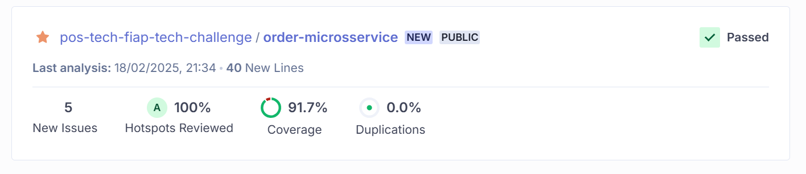

# Order Payment Microservice

## Descrição

O **Order Payment Microservice** é um microsserviço responsável por gerenciar pagamentos de pedidos em uma lanchonete. Ele permite a solicitação de pagamentos e a atualização do status dos pagamentos baseando-se em notificações externas.

## Tecnologias Utilizadas

- **Java 17**
- **Spring Boot**
- **Lombok**
- **MongoDB**
- **Jakarta Validation**
- **Swagger (OpenAPI 3)**
- **Logback/SLF4J**

## Endpoints da API

### 1. Solicitar Pagamento

**Endpoint:** `POST /api/v1/payments`

**Descrição:** Gera uma solicitação de pagamento com base nos detalhes do pedido. Retorna um QR Code ou outro formato visual do pagamento.

**Requisição:**

```json
{
  "orderId": "12345",
  "items": [
    {
      "productId": "abc123",
      "quantity": 2
    }
  ],
  "totalAmount": 45.90
}
```

**Respostas:**
- `200 OK` - QR Code do pagamento gerado com sucesso (retorna uma imagem PNG).
- `400 Bad Request` - Dados da requisição inválidos.
- `500 Internal Server Error` - Erro interno no servidor.

### 2. Atualizar Status do Pagamento

**Endpoint:** `POST /api/v1/payments/notifications`

**Descrição:** Atualiza o status do pagamento com base em uma notificação recebida.

**Parâmetros:**
- `id` (query param) - Identificador do pagamento a ser atualizado.

**Requisição:**

```json
{
  "status": "approved"
}
```

**Respostas:**
- `201 Created` - Status do pagamento atualizado com sucesso.
- `400 Bad Request` - Notificação inválida.
- `500 Internal Server Error` - Erro interno no servidor.

## Como Rodar o Projeto

1. Clone este repositório:
   ```sh
   git clone https://github.com/seu-repositorio/order-payment-service.git
   ```
2. Navegue até o diretório do projeto:
   ```sh
   cd order-payment-service
   ```
3. Compile e execute o projeto:
   ```sh
   mvn spring-boot:run
   ```

## Documentação da API

A documentação da API pode ser acessada via Swagger:

```
http://localhost:8080/swagger-ui/index.html
```

## Logs e Monitoramento

- O microsserviço utiliza **SLF4J** com **Logback** para logging.
- Os logs incluem informações sobre as requisições e notificações recebidas.

## Contribuição

1. Fork este repositório
2. Crie uma branch (`feature/nova-funcionalidade`)
3. Commit suas alterações (`git commit -m 'Adicionando nova funcionalidade'`)
4. Faça push para a branch (`git push origin feature/nova-funcionalidade`)
5. Abra um Pull Request


### Cobertura de testes

